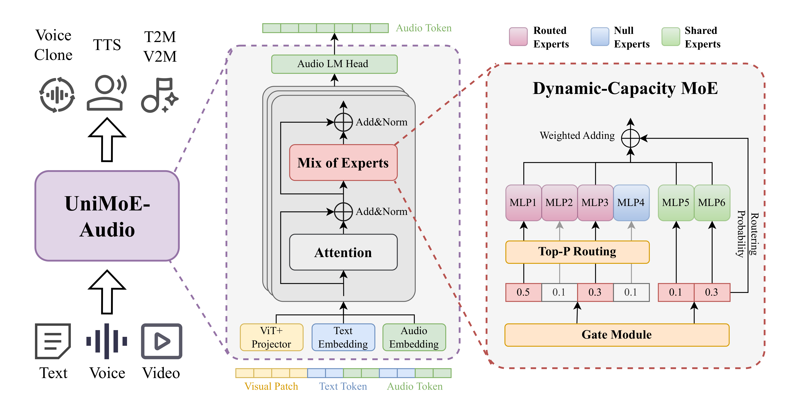
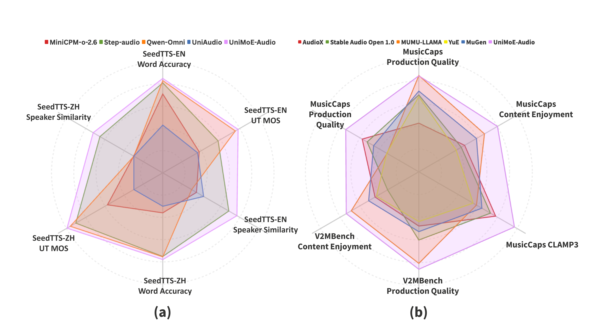

<!-- <p align="center">
    
<p> -->
<!-- <h2 align="center"> <a href="https://github.com/HITsz-TMG/UMOE-Scaling-Unified-Multimodal-LLMs/">Uni-MoE: Scaling Unified Multimodal LLMs with Mixture of Experts</a></h2> -->
<!-- <h5 align="center"> If you appreciate our project, please consider giving us a star ⭐ on GitHub to stay updated with the latest developments.  </h2>

<h4 align="center"> -->


# Welcome to the repo of **UniMoE-Audio**!

### UniMoE-Audio: A Unified Speech and Music Generation via Dynamic-Capacity Mixture of Experts
<div align="left" style="line-height: 1;">
  |
  <a href="https://huggingface.co/foggy-frost-forest/UniMoE-Audio" target="_blank">🤗 HuggingFace</a>
  &nbsp;|
  <a href="docs/UniMoE_Audio-Paper.pdf" target="_blank">📄 Paper</a>
  &nbsp;|
  <a href="https://mukioxun.github.io/Uni-MoE-site/home.html" target="_blank">📰 Website</a>
  &nbsp;|
  <!-- <a href="https://huggingface.co/spaces/XiaomiMiMo/mimo_audio_chat" target="_blank">🔥 Online Demo</a>
  &nbsp;| -->
  <!-- <a href="https://github.com/XiaomiMiMo/MiMo-Audio-Eval" target="_blank">📊 MiMo-Audio-Eval</a>
  &nbsp;| -->
  <br/>
</div>


## Performance Showcase

| Prompt | Audio |
|:--:|:--:|
| This song contains several drum hits and percussive instruments playing a fast paced rhythm that motivates dancing along. An e-bass is bringing the low end supporting the drums. Cuatro guitars are strumming chords as a rhythmic addition. Trumpets are playing a loud and catchy melody. Some of the musical elements are slightly panned to the left and right side of the speakers. This song may be playing at a cheerful event. | <audio controls width="400" height="50"> <source src="https://github.com/HITsz-TMG/UMOE-Scaling-Unified-Multimodal-LLMs/raw/main/UniMoE-Audio/assets/audios/demo_1.mp3" type="audio/mpeg"> demo 1</audio> |
| This song contains a digital drum playing a simple pattern with a kick and a snare sound. Synthesizers are playing a repeating melody in the higher register. Another synth sound is playing a more aggressive lead sound with a countermelody. A string sample is being used to create a short hit. This song may be playing during a car ride. |<audio controls width="400" height="50"><source src="https://github.com/HITsz-TMG/UMOE-Scaling-Unified-Multimodal-LLMs/raw/main/UniMoE-Audio/assets/audios/demo_2.mp3" type="audio/mpeg"> demo 2</audio> |
| This is a four on the floor style of production. The song is a drum and bass type of song with a bright and fuzzy synth to add a melodic element. The first part of the song feels suspenseful. | <audio controls width="400" height="50"> <source src="https://github.com/HITsz-TMG/UMOE-Scaling-Unified-Multimodal-LLMs/raw/main/UniMoE-Audio/assets/audios/demo_3.mp3" type="audio/mpeg"> demo 3</audio>|
| This is a rock music piece. There is a medium-to-high pitched electric guitar solo at the forefront. In the melodic background, a keyboard and a bass guitar repeating the same pattern can be heard. The acoustic drums are playing a loud and slightly fast-paced rock drum beat. There is a rebellious atmosphere to this piece. It can be used in the soundtrack of a teenage drama or a crime shootout audio game. | <audio controls width="400" height="50"> <source src="https://github.com/HITsz-TMG/UMOE-Scaling-Unified-Multimodal-LLMs/raw/main/UniMoE-Audio/assets/audios/demo_4.mp3" type="audio/mpeg"> demo 4</audio> |
|||

https://github.com/user-attachments/assets/08a9ee44-f62b-465f-9793-7e2a45573d29

https://github.com/user-attachments/assets/83adee25-957e-4c81-bff2-108b78633db7

https://github.com/user-attachments/assets/910b1fb1-76c1-4743-9f83-36ecfcbf7f9b

https://github.com/user-attachments/assets/2881161e-f86f-463d-a910-06ab04799eae

More performance showcases can be found in the [web](https://mukioxun.github.io/Uni-MoE-site/showcase.html).
## UniMoE-Audio

**UniMoE-Audio** is a unified framework for speech and music generation.  
It uses a **dynamic-capacity Mixture-of-Experts (MoE)** that adapts to input complexity, enabling high-fidelity voice and expressive music within one model.

### Dynamic-capacity MoE for Task Conflict Mitigation

The core is a Transformer with **Dynamic-Capacity MoE** layers.  
- **Top-P routing** dynamically selects experts per token, avoiding waste on simple tokens and boosting complex ones.  
- Combined with the **three-stage training curriculum**, UniMoE-Audio effectively handles data imbalance and task conflicts.  
[Fig. 2](#fig2) shows the architecture.
 

<div align="center">
<em>Left: Unified architecture for multimodal speech/music generation.<br>
Right: Top-P routing for token-based dynamic expert allocation.</em>

<strong>Fig. 1</strong> UniMoE-Audio Structure
</div>

### Competitive Performance on Comprehensive Speech and Music Metrics

UniMoE-Audio features **Top-P routing** for adaptive expert allocation and a hybrid expert design separating domain-specific and shared computation. 
With a **three-stage training curriculum** (specialist training, warm-up integration, joint training), it supports **voice cloning, TTS, T2M, and V2M**, achieving state-of-the-art performance and cross-task synergy.

 

<div align="center">
<strong>Fig. 2</strong> Performance of UniMoE-Audio
</div>


<!-- 
<p align="center"><strong>Fig. 1</strong>  UniMoE-Audio Structure</p> -->


## Installation
The following instructions are for Linux installation.

### 1. Clone this repository and navigate to the UniMoE Audio folder
```bash
git clone https://github.com/HITsz-TMG/UMOE-Scaling-Unified-Multimodal-LLMs.git
cd UniMoE-Audio 
```

### 2. Set up environment
We recommend using conda to install the environment.
```bash
conda env create -f configs/enviroment.yml      # add -n for your name
conda activate unimoe-audio                     # default name
```
then install the torch packages
  ```bash
   # Use the official index
   pip install torch==2.1.1 torchvision==0.16.1 torchaudio==2.1.1 --index-url https://download.pytorch.org/whl/cu121
   
   # Use Tsinghua mirror source
   pip install torch==2.1.1 torchvision==0.16.1 torchaudio==2.1.1 -i https://pypi.tuna.tsinghua.edu.cn/simple/ --extra-index-url https://download.pytorch.org/whl/cu121
   
   # Use Alibaba Cloud mirror source
   pip install torch==2.1.1 torchvision==0.16.1 torchaudio==2.1.1 -i https://mirrors.aliyun.com/pypi/simple/ --extra-index-url https://download.pytorch.org/whl/cu121
   ```
A `dac model` is also required to be downloaded in '/path/to/UniMoE-Audio/utils/dac_model'.
It will be automatically downloaded when running the first time.

## UniMoE Audio Weights
`All weights` should be downloaded to ensure use.
After downloading all of them, organize the weights as follows in '/path/to/UniMoE-Audio-preview' folder:
```
models
└── UniMoE_Audio-preview
    ├──added_tokens.json
    ├──model.safetensors.index.json
    ├──config.json
    ├──special_tokens_map.json
    ├──merges.txt
    ├──tokenizer_config.json
    ├──trainer_state.json
    ├──video_preprocessor_config.json
    ├──vocab.json
    ├── model-00001-of-00003.safetensors
    ├── model-00002-of-00003.safetensors
    └── model-00003-of-00003.safetensors
```
## How to infer and deploy your demo

### 1.Make sure that all the weights are downloaded and the running environment is set correctly.

### 2.Run inference scripts:

`inference.py`: Simplified inference function for quick single-task calls.
```bash
conda activate unimoe-audio
cd examples

# Music Generating
python inference.py --task text_to_music --input "Caption about music" --output ./music_output --model /path/to/your/model

# Video-to-music generation
python inference.py --task video_text_to_music --input "Upbeat electronic music" --video ./video.mp4 --output ./video_music_output --model /path/to/your/model

# Voice Cloning / TTS
python inference.py --task text_to_speech --input "Input text" --ref-audio ref.mp3 --ref-text "Reference text" --output ./speech_output --model /path/to/your/model
```

`inference_framework.py`: Complete batch processing framework with configuration files.
```bash
cd path/to/UniMoE-Audio
conda activate unimoe-audio
python inference_framework.py --config test_config.json --tasks test_tasks.json --output-results results.json
```
Details about json files can be found in the [examples/README.md](examples/README.md)

### To launch the online demo, run the following command:
Firstly, please install the web dependencies:
```bash
cd path/to/UniMoE-Audio
conda activate unimoe-audio
pip install -r configs/requirements_web.txt
```
```bash
python web_demo.py --model /path/to/your/model
```

