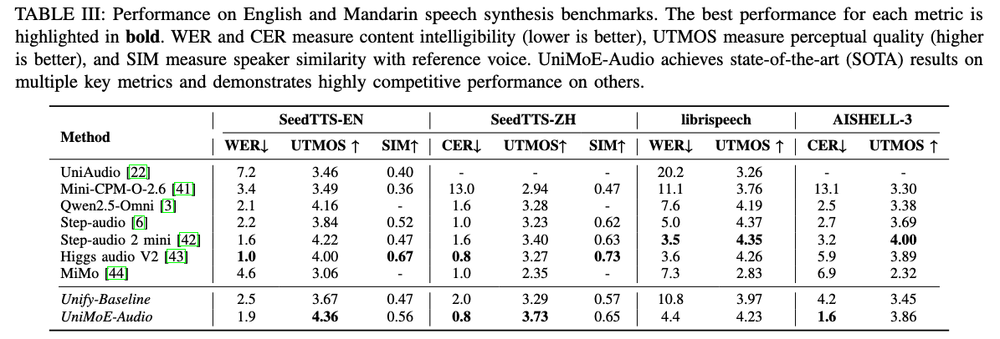
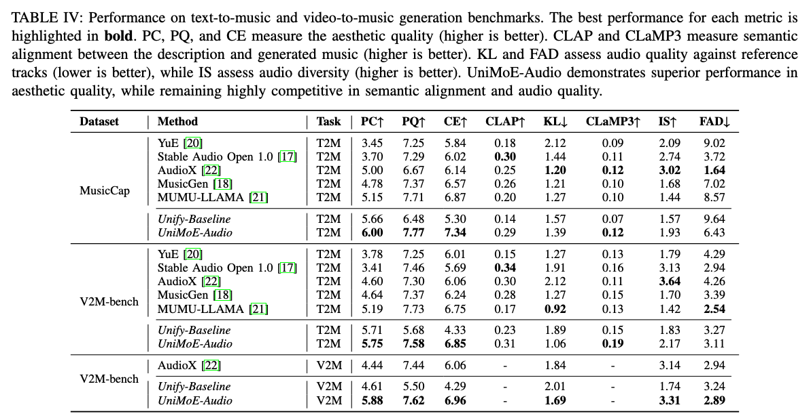

<h1 align="center">UniMoE-Audio: Unified Speech and Music Generation via Dynamic-Capacity Mixture of Experts</h1>

<div align="center" style="display: flex; justify-content: center; margin-top: 10px;">
  <a href="https://mukioxun.github.io/Uni-MoE-site/home.html"></a>
  <a href="docs/UniMoE_Audio-Paper.pdf"></a>
  <a href="https://huggingface.co/foggyforest/UniMoE-Audio-preview"></a>
</div>


<p>
    <strong>UniMoE-Audio</strong> is a unified framework that seamlessly combines speech and music generation. 
    Powered by a novel <strong><a href="https://github.com/HITsz-TMG/Uni-MoE/tree/master/DCMoE">dynamic-capacity Mixture-of-Experts</a> architecture</strong>, it adapts intelligently to input complexity, 
    enabling high-fidelity speech and expressive music within a single model.
</p>
<p>
    To address data imbalance and task conflicts, UniMoE-Audio introduces <strong>a Top-P routing strategy</strong>for adaptive expert number allocation, 
    together with a hybrid expert design that separates domain-specific computation (routed expert), domain-agnostic computation (shared expert) and computation skipping (null expert). 
</p>


<p align="center">
  
</p>
<p align="center">
  
</p>


Here is a short video below for an overview of our model and some showcases:
<p align="center">
    <video src="https://github.com/user-attachments/assets/37bba89b-67de-432f-8efe-847b53a54513" width="80%" controls>
      抱歉，您的浏览器不支持内嵌视频。
    </video>
</p>


## Architecture


<div align="center">
<strong>Fig. 2</strong> An overview of the UniMoE-Audio framework. <strong>Left</strong>: UniMoE-Audio is a unified model capable of performing speech and music generation by leveraging multimodal conditional inputs, including Voice Cloning, Text-to-Speech (TTS), Text-to-Music (T2M), and Video-to-Music (V2M). <strong>Center</strong>: The core architecture of our model is a Transformer with Dynamic-Capacity MoE layers. <strong>Right</strong>: We propose a novel Top-P routing strategy, which dynamically selects the number of experts allocated to each token based on their complexity.
</div>


## Installation
The following instructions are for Linux installation.

### 1. Clone this repository and navigate to the UniMoE Audio folder
```bash
git clone https://github.com/HITsz-TMG/Uni-MoE.git
cd Uni-MoE-mian/UniMoE-Audio 
```

### 2. Set up environment
We recommend using conda to install the environment.
```bash
conda env create -f configs/enviroment.yml      # add -n for your name
conda activate unimoe-audio                     # default name
```
then install the torch packages
  ```bash
   # Use the official index
   pip install torch==2.1.1 torchvision==0.16.1 torchaudio==2.1.1 --index-url https://download.pytorch.org/whl/cu121
   
   # Use Tsinghua mirror source
   pip install torch==2.1.1 torchvision==0.16.1 torchaudio==2.1.1 -i https://pypi.tuna.tsinghua.edu.cn/simple/ --extra-index-url https://download.pytorch.org/whl/cu121
   
   # Use Alibaba Cloud mirror source
   pip install torch==2.1.1 torchvision==0.16.1 torchaudio==2.1.1 -i https://mirrors.aliyun.com/pypi/simple/ --extra-index-url https://download.pytorch.org/whl/cu121
   ```
A `dac model` is also required to be downloaded in '/path/to/UniMoE-Audio/utils/dac_model'.
It will be automatically downloaded when running the first time.

## UniMoE Audio Weights
`All weights` should be downloaded to ensure use.
After downloading all of them, organize the weights as follows in '/path/to/UniMoE-Audio-preview' folder:
```
models
└── UniMoE_Audio-preview
    ├──added_tokens.json
    ├──model.safetensors.index.json
    ├──config.json
    ├──special_tokens_map.json
    ├──merges.txt
    ├──tokenizer_config.json
    ├──trainer_state.json
    ├──video_preprocessor_config.json
    ├──vocab.json
    ├── model-00001-of-00003.safetensors
    ├── model-00002-of-00003.safetensors
    └── model-00003-of-00003.safetensors
```
## How to infer and deploy your demo

### 1.Make sure that all the weights are downloaded and the running environment is set correctly.

### 2.Run inference scripts:

`inference.py`: Simplified inference function for quick single-task calls.
```bash
conda activate unimoe-audio
cd examples

# Generate music
python inference.py --task text_to_music --input "A peaceful piano melody" --output ./music_output --model /path/to/your/model

# Voice cloning
python inference.py --task text_to_speech --input "Hello world" --ref-audio ref.wav --ref-text "Reference text" --output ./speech_output --model /path/to/your/model

# Video-to-music generation
python inference.py --task video_text_to_music --input "Upbeat electronic music" --video ./video.mp4 --output ./video_music_output --model /path/to/your/model
```

`inference_framework.py`: Complete batch processing framework with configuration files.
```bash
cd path/to/UniMoE-Audio
conda activate unimoe-audio
python inference_framework.py --config test_config.json --tasks test_tasks.json --output-results results.json
```
Details about json files can be found in the [examples/README.md](examples/README.md)

### To launch the online demo, run the following command:
Firstly, please install the web dependencies:
```bash
cd path/to/UniMoE-Audio
conda activate unimoe-audio
pip install -r configs/requirements_web.txt
```
```bash
python web_demo.py --model /path/to/your/model
```

