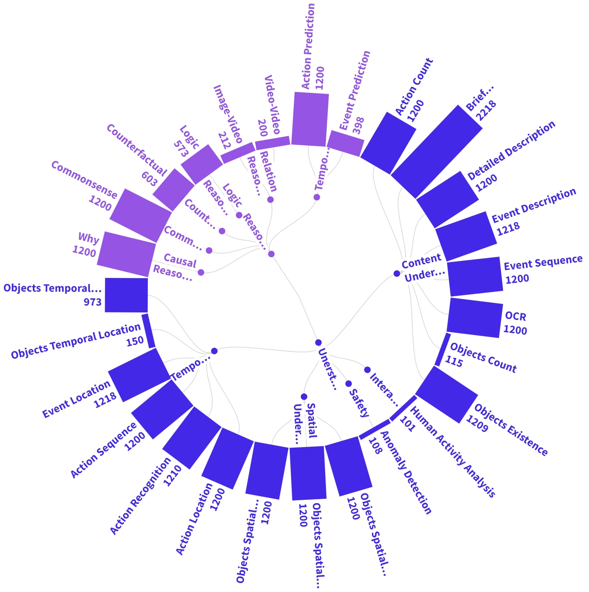
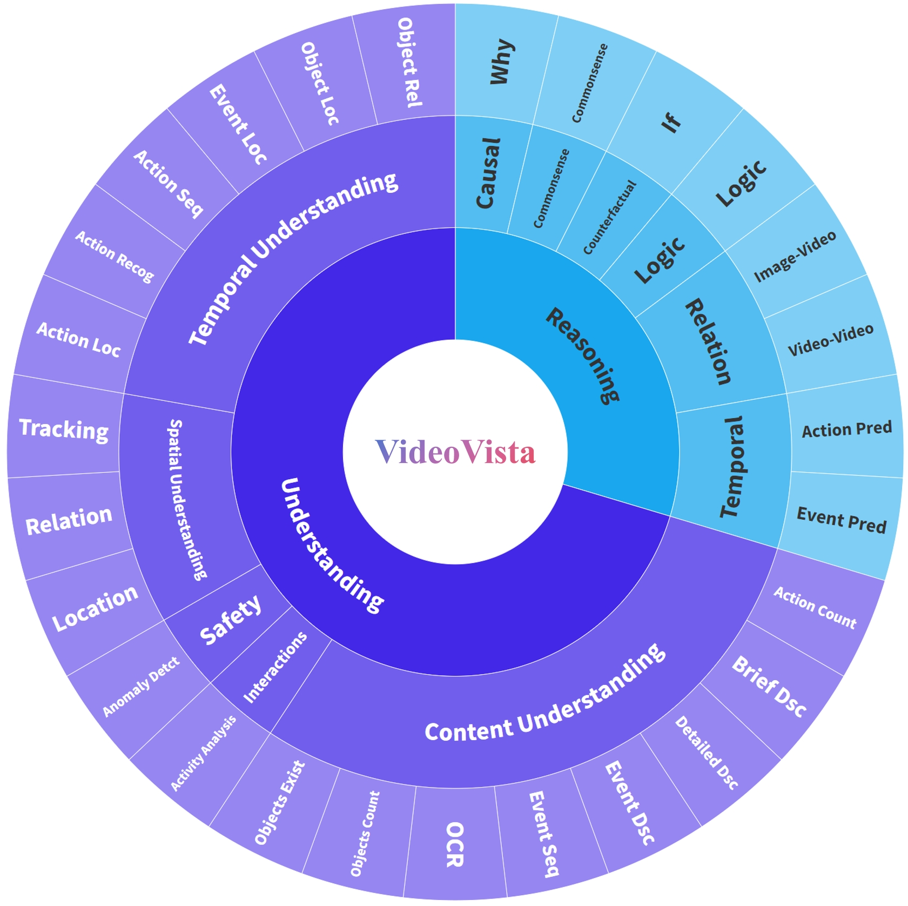
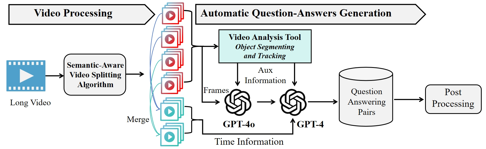
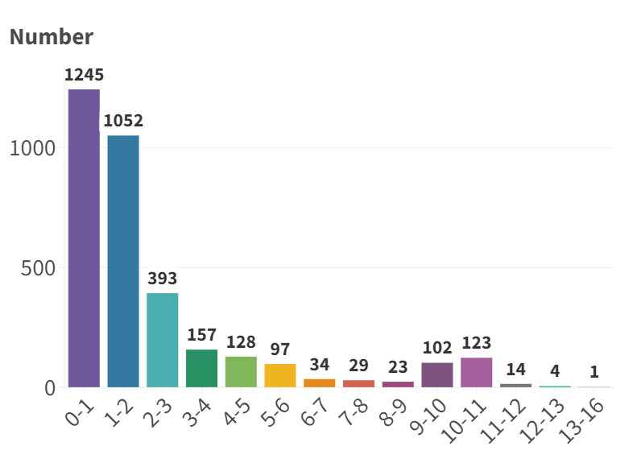
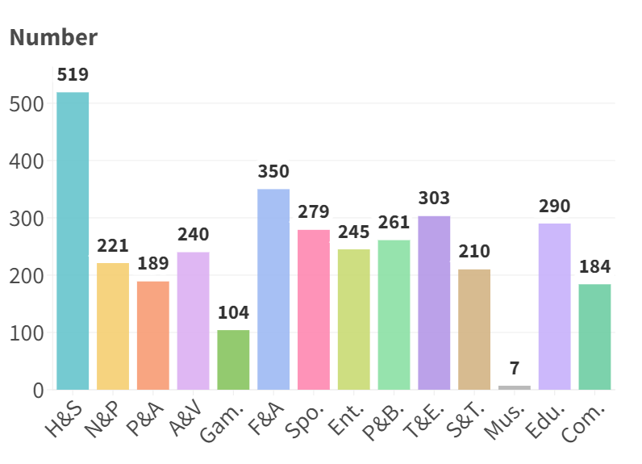
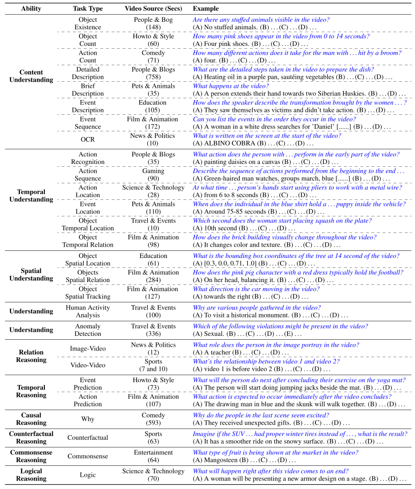
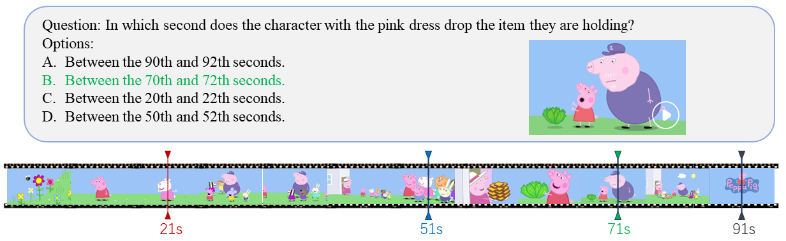

# VideoVista: A Versatile Benchmark for Video Understanding and Reasoning

<font size=2><div align='center' >  [[✨ Project ](https://videovista.github.io)] [[🏆 Leaderboard](https://videovista.github.io/#leaderboard)] [[📖 arXiv Paper](https://arxiv.org/abs/2406.11303)] [[📊 Dataset ](https://huggingface.co/datasets/Uni-MoE/VideoVista)] </div></font>

If you like our project, please consider giving us a star ⭐ on the Uni-MoE repository to stay updated with the latest developments.

---
## 🔥 News


**`2024.10.20`** 🚀 We release the video-text description pair data [VideoVista-Event](https://huggingface.co/datasets/Uni-MoE/VideoVista-Event) for the community. 

**`2024.09.06`** 🚀 We release the automatic data generation framework for the community. 

**`2024.08.29`** 🚀 We have continued to evaluate 38 large video models and open-sourced the automatically constructed VideoVista training set at [VideoVista Training Data](https://huggingface.co/datasets/Uni-MoE/VideoVista_Train). 

**`2024.07.19`** 🚀 There were over thirty models evaluated on the VideoVista dataset, and we provided the evaluation results for the newly released [GPT-4o-mini](https://openai.com/index/gpt-4o-mini-advancing-cost-efficient-intelligence/) model!

**`2024.07.5`** 🚀 We add the evaluation results of more Video-LMMs (more than 20) in our [✨ Project Web ](https://videovista.github.io)

**`2024.06.15`** 🚀 The evaluation code for VideoVista is released! **This is the first dataset that includes a wide variety of task types, with a particular emphasis on video safety detection and logical/relationship reasoning.**

**`2024.06.11`** 🚀 We release VideoVista, a Versatile Benchmark for Video Understanding and Reasoning. You can download the evaluation part of VideoVista from [hugging face](https://huggingface.co/datasets/Uni-MoE/VideoVista). We will release all 100k training data and enhanced Uni-MoE-v2 soon.

## 🌟 VideoVista Overview

Despite significant breakthroughs in video analysis driven by the rapid development of large multimodal models (LMMs), there remains a lack of a versatile evaluation benchmark to comprehensively assess these models' performance in video understanding and reasoning. 

We introduce **VideoVista**, a video benchmark that integrates challenges across diverse content categories, durations, and abilities.  Specifically, VideoVista comprises **25,000** questions derived from **3,400** videos spanning **14** categories (e.g., Howto, Film, and Entertainment) with durations ranging from a few seconds to over 10 minutes. Besides, it encompasses **19** types of understanding tasks (e.g., anomaly detection, interaction understanding) and **8** reasoning tasks (e.g., logical reasoning, causal reasoning).

[//]: # ()
[//]: # (<figure style="margin: 0; text-align: center;">)

[//]: # (    )

[//]: # (    <figcaption>Figure 1: Sample Count for Task Types</figcaption>)

[//]: # (</figure>)

[//]: # (<div align=center></div>)
<table>
  <tr>
    <td style="text-align: center;">
      
    </td>
    <td style="text-align: right;">
      
    </td>
  </tr>
</table>


To this end, we develop an automatic video annotation framework that efficiently creates large-scale training and evaluates VideoQA datasets. 
The automatic process is shown in the following figure.

[//]: # ()
[//]: # (<figure style="margin: 0; text-align: center;">)

[//]: # (    )

[//]: # (    <figcaption>Figure 1: Sample Count for Task Types</figcaption>)

[//]: # (</figure>)

<div align=center></div>


## 🗝️ Dataset Statistics
<table>
  <tr>
    <td style="text-align: center;">
      
      <figcaption>The statistics of 14 video categories</figcaption>
    </td>
    <td style="text-align: center;">
      
      <figcaption>The distribution of video durations</figcaption>
    </td>
  </tr>
</table>


[//]: # (<div style="display: flex; justify-content: space-between;">)

[//]: # (    <figure style="width: 45%; text-align: center;">)

[//]: # (        )

[//]: # (        <figcaption>Figure 2: The statistics of 14 video categories</figcaption>)

[//]: # (    </figure>)

[//]: # (    <figure style="width: 45%; text-align: center;">)

[//]: # (        )

[//]: # (        <figcaption>Figure 3: The distribution of video durations &#40;minute&#41;</figcaption>)

[//]: # (    </figure>)

[//]: # (</div>)

## 🔍 Dataset Example

[//]: # (<figure style="margin: 0; text-align: center;">)

[//]: # (    )

[//]: # (    <figcaption>Figure 4: Example for Task Types</figcaption>)

[//]: # (</figure>)

<div align=center></div>

[//]: # (## Dataset Examples)

[//]: # ()
[//]: # ([//]: # &#40;![image/png]&#40;assest/Example.jpg&#41;&#41;)
[//]: # ()
[//]: # (<p align="center">)

[//]: # (    )

[//]: # (</p>)

[//]: # (For each type of task, we also provide a text-based example.)

[//]: # (![image/png]&#40;asset/Case.jpg&#41;)

## 🌈 Evaluation

You can download the JSON file and VIDEOS from [Huggingface-VideoVista](https://huggingface.co/datasets/Uni-MoE/VideoVista).

When downloading videos, you may need to download all the zip files with different suffixes. After that, just extract the file using follow command.

```shell
cat merged.zip* > merged.zip
unzip merged.zip
```
The video_name attribute in the JSON file corresponds one-to-one with the video name.

When evaluating the Relation Reasoning-Image task, you also need to download [relation images](https://huggingface.co/datasets/Uni-MoE/VideoVista/blob/main/relation_images.zip) to obtain the queried images.

During evaluation, you can add a Model_Answer attribute to the original VideoVista.json file to store the model's prediction results, and then use the [evaluation code](https://github.com/HITsz-TMG/UMOE-Scaling-Unified-Multimodal-LLMs/blob/master/VideoVista/evaluation/evaluation_videovista.py) in the evaluation directory.

For Chinese users experiencing slow download speeds with Hugging Face, you can use [HF-Mirror](https://hf-mirror.com/) to speed up downloads.

## :yum: Leaderboard

Details about more baselines are shown in [🏆 Leaderboard](https://videovista.github.io/#leaderboard)

| Model                  | Language Model | Frames | Unders. | Reason. | Overall |
|------------------------|----------------|--------|---------|---------|---------|
| VideoChat+ChatGPT | gpt-3.5-turbo  | 40     | 16.64   | 23.04   | 17.99   |
| Video-LLAMA      | Vicuna-7B      | 16     | 25.40   | 25.16   | 25.35   |
| Video-ChatGPT     | Vicuna-7B      | 100    | 36.09   | 38.73   | 36.65   |
| IVA                | Vicuna-7B      | 200    | 37.38   | 48.38   | 39.70   |
| Video-LLAVA      | Vicuna-7B      | 8      | 53.82   | 66.91   | 56.59   |
| LLAMA-VID         | Vicuna-7B      | 1 fps  | 54.00   | 67.61   | 56.87   |
| LLAVA-NeXT-Video   | Vicuna-7B      | 16     | 54.12   | 66.14   | 56.66   |
| VideoChat2-Vicuna  | Vicuna-7B      | 16     | 51.79   | 60.55   | 53.64   |
| VideoChat2-Mistral | Mistral-7B     | 16     | 54.91   | 65.95   | 57.24   |
| Gemini-1.5-Flash       | Gemini         | 1 fps  | 74.73   | 82.30   | 76.39   |
| GPT-4o (**Best** :rocket:)                | GPT-4o         | 100    | **75.15**   | **87.97**   | **78.26**   |


## Citation

If you find VideoVista useful for your research and applications, please cite using this BibTeX:
```bibtex
@misc{li2024videovista,
      title={VideoVista: A Versatile Benchmark for Video Understanding and Reasoning}, 
      author={Yunxin Li and Xinyu Chen and Baotian Hu and Longyue Wang and Haoyuan Shi and Min Zhang},
      year={2024},
      eprint={2406.11303},
      archivePrefix={arXiv}
}

```
